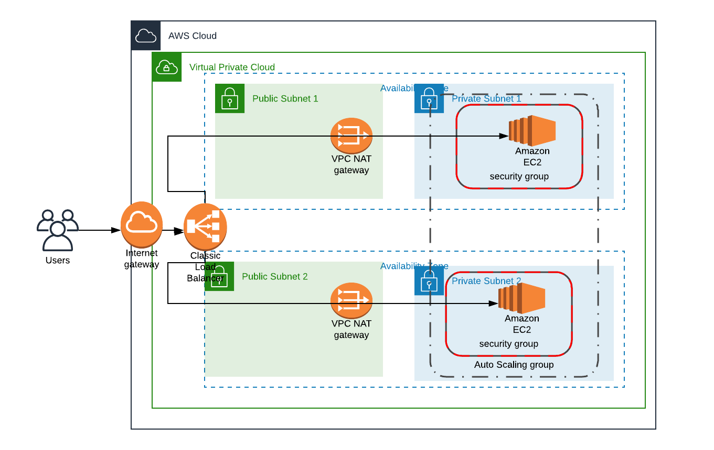

# High-availability web app

Code which sets up both the networking and compute infrastructure for a high-availability web app using AWS Cloud Formation. The web app itself is pulled from a public S3 bucket. Done as part of Udacity Cloud Engineer Nanodegree

## Infrastructure Diagram

Below is a diagram of the infrastructure that was created:

## Update / Create Scripts

create_stack.sh and update_stack.sh to create and update the stack respectively

## Networking

This is detailed in the network.yml and network_parameters.json and contains the following:

* 1 VPC
* 1 IGW
* 2 NAT gateways, along with 2 EIP addresses
* 4 Subnets - 2 pub, 2 private
* 1 Public Route Table
* 2 Private Route Tables

## Compute

This is detailed in the compute.yml and compute_parameters.json and contains the following:

* 2 Security Groups (one for EC2 instances, one for ALB)
* Application Load Balancer (with Listeners)
* Target Group
* Launch Config + Autoscaling Group
* Instance Role
